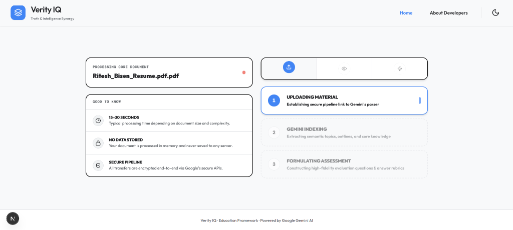
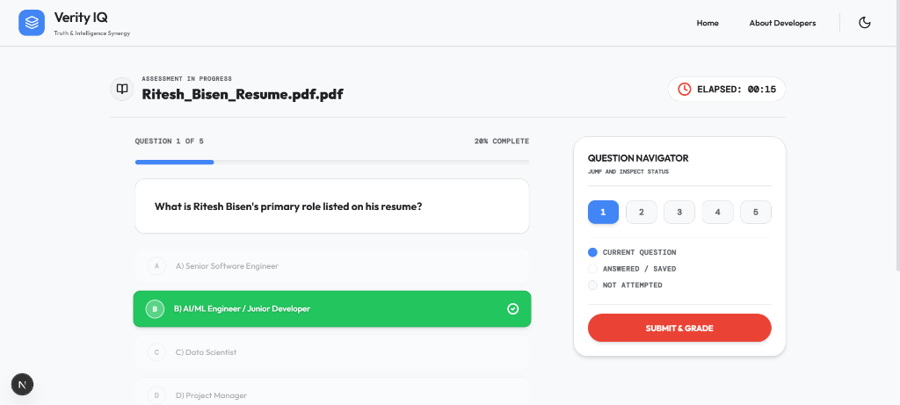
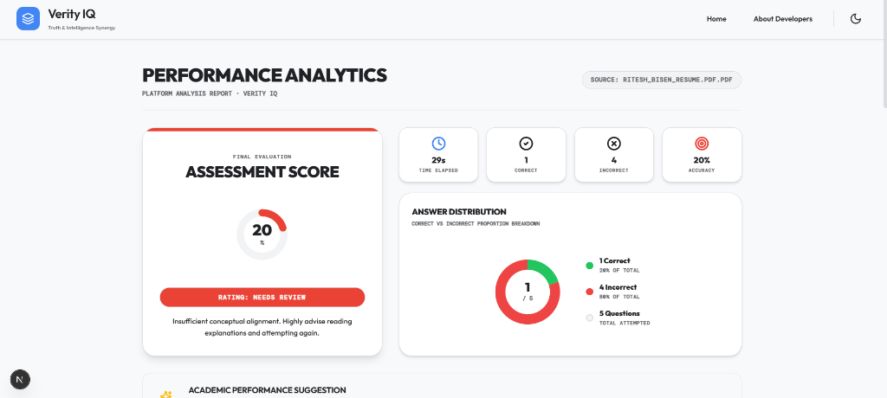

# 🧠 Verity IQ — Autonomous MCQ Generator

> Upload any document. Get a quiz in seconds. Powered by **Google Gemini 2.0 Flash**.
> 
> 🌐 **Live Demo:** [verity-iq.vercel.app](https://verity-iq.vercel.app/)


---

## 📷 Screenshots

### 1. Dashboard & File Upload


### 2. Processing Document


### 3. Interactive Quiz


### 4. AI Academic Tutor Chat


### 5. Performance Analytics


---

## ✨ Features

- **Drag & Drop Upload** — PDF, TXT, or DOCX up to 20MB
- **Gemini Native File Processing** — Documents are uploaded directly to Gemini's Files API for native understanding
- **Structured JSON Output** — Gemini returns perfectly typed MCQs via `response_schema`
- **Interactive Quiz UI** — One-by-one card view with animated Framer Motion transitions
- **Instant Feedback** — Green/Red highlighting with explanations revealed on answer
- **Results Dashboard** — Score, grade, time taken, and per-question review
- **Contact Support Form** — Direct messaging to developers with instant validation and a floating emoji success screen
- **SMTP Support Integration** — Real email forwarding to support mailboxes with mock backup logging
- **Community Milestones** — Counter-animated tracker showing donations, chais funded, and supporter stats
- **Dark Mode SaaS Design** — Glassmorphism, subtle grain, Outfit + DM Mono fonts
- **Mobile-first** — Fully responsive for student devices

---

## 🏗️ Architecture

```
mcq-generator/
├── backend/                   # FastAPI + Gemini
│   ├── main.py                # API endpoint, Gemini integration, cleanup
│   ├── requirements.txt       # Python dependencies
│   └── .env.example           # Environment variable template
│
└── frontend/                  # Next.js 15 + TypeScript
    ├── app/
    │   ├── page.tsx            # State machine: IDLE→PROCESSING→QUIZ→RESULTS
    │   ├── layout.tsx          # Root layout with fonts + Sonner Toaster
    │   └── globals.css         # Tailwind base + custom utilities
    ├── components/
    │   ├── FileDropzone.tsx    # react-dropzone with drag animation
    │   ├── ProcessingView.tsx  # Animated 3-step progress indicator
    │   ├── QuizView.tsx        # AnimatePresence card transitions
    │   ├── QuizCard.tsx        # Option selection + feedback + explanation
    │   ├── ResultsView.tsx     # Score, grade, stats, question review
    │   ├── ContactForm.tsx     # Contact support form with validation
    │   ├── CommunityMetrics.tsx# Animated support tracking benchmarks
    │   └── SupportModal.tsx    # Payment simulation and coffee support modal
    ├── services/
    │   └── api.ts              # FormData fetch → FastAPI, error handling
    ├── types/
    │   └── index.ts            # Shared MCQ + AppState TypeScript types
    ├── lib/
    │   └── utils.ts            # cn() tailwind-merge utility
    └── .env.example
```

---

## 🚀 Quick Start

### Prerequisites

- **Python 3.12+**
- **Node.js 20+** (or Bun / pnpm)
- A **Google Gemini API key** → [Get one free at Google AI Studio](https://aistudio.google.com/app/apikey)

---

### 1. Clone & Configure

```bash
git clone <your-repo-url>
cd mcq-generator
```

---

### 2. Backend Setup

```bash
cd backend

# Create and activate a virtual environment
python -m venv .venv
source .venv/bin/activate        # Windows: .venv\Scripts\activate

# Install dependencies
pip install -r requirements.txt

# Configure environment
cp .env.example .env
# Edit .env and add your GOOGLE_API_KEY
```

**`.env` (backend)**
```env
GOOGLE_API_KEY=AIza...your_key_here
FRONTEND_URL=http://localhost:3000
```

```bash
# Start the backend server
uvicorn main:app --reload --port 8000
```

Backend runs at: **http://localhost:8000**
Interactive API docs: **http://localhost:8000/docs**

---

### 3. Frontend Setup

```bash
cd ../frontend

# Install dependencies
npm install        # or: pnpm install / bun install

# Configure environment
cp .env.example .env.local
# Edit .env.local (defaults work for local dev)
```

**`.env.local` (frontend)**
```env
NEXT_PUBLIC_API_URL=http://localhost:8000
```

```bash
# Start the development server
npm run dev
```

Frontend runs at: **http://localhost:3000**

---

## 🔌 API Reference

### `POST /api/contact`

Submits a message from the contact form to the support mailbox via SMTP or logs to console in Mock Mode.

**Request**
```
Content-Type: application/json
Body:
{
  "name": "Jane Doe",
  "email": "jane@example.com",
  "category": "Bug Report",
  "subject": "Optional subject text",
  "message": "Detailed message text"
}
```

**Response `200 OK`**
```json
{
  "status": "success",
  "message": "We've received your message and will get back to you as soon as possible."
}
```

---

### `POST /api/generate`

Accepts a multipart form upload and returns 10 AI-generated MCQs.

**Request**
```
Content-Type: multipart/form-data
Body: file=<binary file data>
```

**Supported MIME types**
| Format | MIME Type |
|--------|-----------|
| PDF    | `application/pdf` |
| TXT    | `text/plain` |
| DOCX   | `application/vnd.openxmlformats-officedocument.wordprocessingml.document` |

**Response `200 OK`**
```json
{
  "questions": [
    {
      "id": "q1",
      "question": "What is the primary purpose of...",
      "options": [
        "Option A text",
        "Option B text",
        "Option C text",
        "Option D text"
      ],
      "correctAnswer": "Option B text",
      "explanation": "Option B is correct because..."
    }
  ],
  "document_name": "lecture_notes.pdf",
  "total_questions": 10
}
```

**Error responses**
| Status | Reason |
|--------|--------|
| `400`  | Empty file |
| `413`  | File exceeds 20MB |
| `415`  | Unsupported file type |
| `422`  | Gemini failed to process file |
| `500`  | AI generation error |
| `504`  | File processing timeout |

---

## 🎨 UI State Machine

```
IDLE ──(file dropped)──► PROCESSING ──(API success)──► QUIZ ──(all answered)──► RESULTS
                              │                                                      │
                              └──(API error)──► IDLE ◄──────(New File)─────────────┘
                                                              ◄──────(Retry)──── QUIZ
```

### Processing Steps

```
Uploading Document  →  Gemini is Reading  →  Generating Questions  →  [Quiz starts]
     (Upload)              (Reading)               (Generating)
```

---

## 🛠️ Tech Stack

| Layer | Technology | Purpose |
|-------|------------|---------|
| AI Model | Google Gemini 2.0 Flash | Document understanding + MCQ generation |
| File API | Gemini Files API | Native PDF/DOCX processing |
| Backend | FastAPI (Python 3.12) | REST API, file handling, orchestration |
| Frontend | Next.js 15 (App Router) | SSR-ready React application |
| Language | TypeScript | Type-safe data contract |
| Styling | Tailwind CSS v3 | Utility-first responsive styling |
| Animation | Framer Motion | Card transitions, processing orb |
| File Upload | react-dropzone | Drag & drop with validation |
| Icons | Lucide React | Consistent icon system |
| Notifications | Sonner | Toast error messages |
| Fonts | Outfit + DM Mono | Display + monospace pairing |

---

## ⚙️ Configuration Options

### Backend (`backend/.env`)

| Variable | Required | Default | Description |
|----------|----------|---------|-------------|
| `GOOGLE_API_KEY` | ✅ Yes | — | Your Gemini API key |
| `FRONTEND_URL` | No | `http://localhost:3000` | CORS origin |
| `SMTP_HOST` | No | — | SMTP mail server hostname (e.g. `smtp.gmail.com`) |
| `SMTP_PORT` | No | `587` | SMTP mail server port (e.g., `587` or `465`) |
| `SMTP_USER` | No | — | SMTP username / login account address |
| `SMTP_PASSWORD` | No | — | SMTP account app password / credentials |
| `SUPPORT_EMAIL` | No | — | Support mailbox recipient email address |

### Frontend (`frontend/.env.local`)

| Variable | Required | Default | Description |
|----------|----------|---------|-------------|
| `NEXT_PUBLIC_API_URL` | No | `http://localhost:8000` | Backend API base URL |

---

## 🚢 Deployment

### Backend (e.g. Railway, Render, Fly.io)

```bash
# Production start command
uvicorn main:app --host 0.0.0.0 --port $PORT
```

Set environment variables in your platform's dashboard:
- `GOOGLE_API_KEY`
- `FRONTEND_URL` → your deployed frontend URL

### Frontend (Vercel)

```bash
vercel deploy
```

Set in Vercel project settings → Environment Variables:
- `NEXT_PUBLIC_API_URL` → your deployed backend URL

---

## 🔒 Privacy & Security

- Uploaded files are **never stored** on the backend server
- Files are sent to Gemini's Files API and **deleted immediately** after MCQ generation
- Gemini processes files in temporary storage with automatic TTL expiry
- CORS is locked to your configured `FRONTEND_URL`

---

## 🐛 Troubleshooting

**Backend won't start**
```bash
# Verify your API key is valid
python -c "from google import genai; client = genai.Client(api_key='YOUR_KEY'); print('OK')"
```

**CORS errors in browser**
```bash
# Make sure FRONTEND_URL in backend .env matches exactly
# e.g. http://localhost:3000 (no trailing slash)
```

**File upload returns 415**
- Ensure the file is a genuine PDF/TXT/DOCX (not renamed)
- Check MIME type: `file --mime-type yourfile.pdf`

**Gemini returns empty response**
- Try a document with more substantial text content (at least 500 words recommended)
- Scanned image-only PDFs may not work well — use text-based PDFs

---

## 📄 License

MIT — free to use, modify, and deploy.
